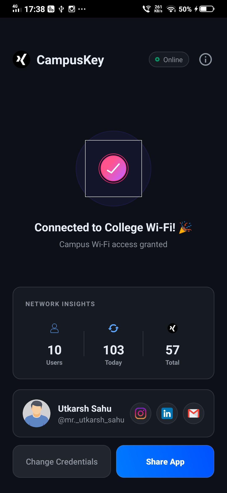

<div align="center">


# CampusKey 🎓

### Automatic Wi-Fi Login for Kalinga University

[](https://android.com)
[](https://java.com)
[](https://firebase.google.com)
[](https://developer.android.com)
[](LICENSE)

> Walk into campus. Phone connects to Wi-Fi. You're on the internet.
> No portal. No login page. No waiting. **Just CampusKey.**

</div>

---

## ✨ Features

- **🔄 Auto Login** — Detects college Wi-Fi and logs in silently in the background
- **🔔 Boot on Startup** — Service starts automatically when your phone boots
- **📊 Live Stats** — Real-time Firebase dashboard showing total users, today's logins, all-time count
- **👤 Developer Profile** — Updated live from Firebase, no app update needed
- **📱 User Guide** — 6-slide onboarding shown on first launch
- **⚡ Force Update** — Admin can push required updates remotely via Firebase
- **🔕 Push Notifications** — Admin can broadcast messages to all users via FCM
- **🛡️ Admin Panel** — Web-based dashboard to manage everything

---

## 📸 Screenshots

| Main Screen | Connected Screen | User Guide | Admin Panel |
|:-----------:|:----------------:|:----------:|:-----------:|
|  |  |  |  |

> Add your screenshots to a `/screenshots` folder in the repo root.

---

## 🏗️ Project Structure

```
app/src/main/
├── java/com/utkarsh/CampusKey/
│   ├── MainActivity.java          # Main screen + Firebase profile fetch
│   ├── WifiLoginService.java      # Background auto-login service
│   ├── BootReceiver.java          # Starts service on device boot
│   ├── ConnectedActivity.java     # Success screen with live stats
│   ├── UserGuideActivity.java     # Onboarding slides
│   ├── FCMService.java            # Push notification receiver
│   ├── AnalyticsHelper.java       # Firebase analytics
│   ├── DatabaseHelper.java        # Local SQLite credentials
│   ├── LocalData.java             # SharedPreferences wrapper
│   └── AppUtils.java              # Utility helpers
│
├── res/
│   ├── layout/
│   │   ├── activity_main.xml
│   │   ├── activity_connected.xml
│   │   ├── activity_user_guide.xml
│   │   └── dialog_user_profile.xml
│   ├── drawable/
│   │   ├── btn_social_bg.xml
│   │   ├── stat_bg.xml
│   │   ├── dialog_bg.xml
│   │   └── dev_photo.png          # ← Add your photo here
│   ├── raw/
│   │   └── done_animation.json    # ← Lottie checkmark animation
│   └── xml/
│       └── network_security_config.xml
│
└── AndroidManifest.xml
```

---

## ⚙️ Setup

### 1. Clone the repo

```bash
git clone https://github.com/yourusername/CampusKey.git
cd CampusKey
```

### 2. Connect Firebase

1. Go to [Firebase Console](https://console.firebase.google.com) → Create project
2. Add Android app → package name: `com.utkarsh.CampusKey`
3. Download `google-services.json` → place in `app/` folder
4. Enable **Realtime Database** and **Cloud Messaging** in Firebase Console

### 3. Set up Firebase Database structure

In Firebase Console → Realtime Database, import this JSON:

```json
{
  "campuskey_config": {
    "developer": {
      "name": "Your Name",
      "username": "your_username",
      "photoUrl": "https://link-to-your-photo.jpg",
      "instagram": "https://instagram.com/yourprofile",
      "linkedin": "https://linkedin.com/in/yourprofile",
      "email": "your@email.com"
    },
    "force": false,
    "minimumVersionCode": 1,
    "url": "",
    "mainText": "",
    "description": "",
    "maintenance": false
  }
}
```

### 4. Add Lottie animation

Download any checkmark/success animation from [lottiefiles.com](https://lottiefiles.com) and save as:
```
app/src/main/res/raw/done_animation.json
```

### 5. Add your photo

Place your profile photo at:
```
app/src/main/res/drawable/dev_photo.png
```

### 6. Build and Run

Open in **Android Studio**, sync Gradle, and run on a device with API 26+.

---

## 🌐 Admin Panel

A web-based admin panel (`campuskey_admin.html`) is included for full remote control.

**Features:**

| Tab | What you can do |
|-----|----------------|
| 📊 Dashboard | View total users, today's logins, all-time count |
| 👥 Users | See every user's name, gender, login count, last seen |
| 🔔 Notifications | Send push notifications to all users via FCM |
| 👤 Dev Profile | Update name, photo, social links — reflects in app instantly |
| ⚙️ App Control | Force update toggle, minimum version, maintenance mode |

**Setup:**
1. Open `campuskey_admin.html` in any browser
2. Replace the `firebaseConfig` values at the bottom with your project config
3. Go to Firebase → Authentication → Add User (your email + password)
4. Log in with those credentials

---

## 🔧 Portal Details

This app is built for the **Kalinga University** captive portal:

| Detail | Value |
|--------|-------|
| Portal URL | `http://172.24.64.1:8090/httpclient.html` |
| Username field | `id="username"` |
| Password field | `id="password"` |
| Login button | `id="loginbutton"` |
| Internet check | `kalingauniversity.ac.in` |

> To adapt for another university, update `PORTAL_URL` and the internet check URLs in `WifiLoginService.java`.

---

## 📦 Dependencies

```gradle
// Firebase
implementation platform('com.google.firebase:firebase-bom:33.1.0')
implementation 'com.google.firebase:firebase-database'
implementation 'com.google.firebase:firebase-analytics'
implementation 'com.google.firebase:firebase-messaging'

// UI
implementation 'com.airbnb.android:lottie:6.4.0'
implementation 'com.github.bumptech.glide:glide:4.16.0'
implementation 'androidx.viewpager2:viewpager2:1.0.0'
implementation 'com.google.android.material:material:1.12.0'
```

---

## 🔒 Permissions

```xml
INTERNET
ACCESS_NETWORK_STATE
ACCESS_WIFI_STATE
FOREGROUND_SERVICE
RECEIVE_BOOT_COMPLETED
POST_NOTIFICATIONS
```

---

## ⚠️ Important Notes

- **MIUI / Samsung / Chinese phones** — Go to Settings → Battery → CampusKey → Set "No restrictions" so the background service is not killed
- Credentials are stored locally in **SQLite** on the device and never sent anywhere except to the college portal
- The app only auto-logs in when connected to the **college Wi-Fi** — it does nothing on other networks

---

## 👤 Developer

<table>
  <tr>
    <td align="center">
      <strong>Utkarsh Sahu</strong><br/>
      <a href="https://instagram.com/mr._utkarsh_sahu">📸 Instagram</a> •
      <a href="https://linkedin.com/in/utkarshsahu9906">💼 LinkedIn</a> •
      <a href="mailto:utkarshsahu9906@gmail.com">✉️ Email</a>
    </td>
  </tr>
</table>

---

## 📄 License

```
MIT License — feel free to fork, adapt, and use for your own college.
```

---

<div align="center">

**Made with ❤️ for Kalinga University students**

*If CampusKey saves you time every day, give it a ⭐ on GitHub!*

</div>
